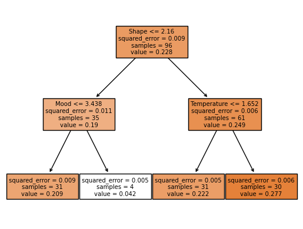

# dim-tree

Data: 22 dimensions along which objects can change (scale of 1-7)
Each row corresponds to a separate event (e.g. cutting an onion). 
Each dimension is a rating of how much an event changes an object (e.g. large change in flavor but small change in temperature).
Aim is to predict BOLD (average brain response) collected for reading about each event.

First approach here is fitting decision tree regressors of varying depths.
I'm using a train/test split of 80/20.


```python
import os
import pandas as pd
import numpy as np
from matplotlib import pyplot

data = pd.read_csv('data.csv')
data = data.drop(columns=['Question','QuestForCorr'])
data = data.rename(columns={'1: Size':'Size','10: Temperature': 'Temperature','11: Tension':'Tension','12: Scent':'Scent',
                   '13: Flavor':'Flavor','14: Sound':'Sound','15: Stability':'Stability','16: Motoric_interaction':'Motor',
                   '17: Function':'Function','18: Value':'Value','19: Knowledge':'Knowledge','2: Shape':'Shape',
                   '20: Emotional_affect':'Affect','21: Mood':'Mood','22: Weight':'Weight','3: Position':'Position',
                   '4: Form':'Form','5: Color':'Color','6: Light':'Light','7: Surroundings':'Surroundings',
                   '8: Location':'Location','9: Texture':'Texture','Bold':'BOLD'})

feats = data.drop(columns='BOLD')
bold = data['BOLD']

from sklearn.model_selection import train_test_split
X_train, X_test, y_train, y_test = train_test_split(feats, bold, test_size=0.20)

feature_names = np.array(list(feats.columns.values))

#tree

from sklearn.tree import DecisionTreeRegressor

# Fit regression model
regr_1 = DecisionTreeRegressor(max_depth=2)
regr_2 = DecisionTreeRegressor(max_depth=5)
regr_3 = DecisionTreeRegressor(max_depth=7)
regr_4 = DecisionTreeRegressor(max_depth=10)
regr_5 = DecisionTreeRegressor()

regr_1.fit(X_train, y_train)
print("train 1:", regr_1.score(X_train, y_train))
print("test 1:", regr_1.score(X_test, y_test))

regr_2.fit(X_train, y_train)
print("train 2:", regr_2.score(X_train, y_train))
print("test 2:", regr_2.score(X_test, y_test))

regr_3.fit(X_train, y_train)
print("train 3:", regr_3.score(X_train, y_train))
print("test 3:", regr_3.score(X_test, y_test))

regr_4.fit(X_train, y_train)
print("train 4:", regr_4.score(X_train, y_train))
print("test 4:", regr_4.score(X_test, y_test))

regr_5.fit(X_train, y_train)
print("train 5:", regr_5.score(X_train, y_train))
print("test 5:", regr_5.score(X_test, y_test))
```

    train 1: 0.2579349868440104
    test 1: -0.18314345899632056
    train 2: 0.5534348313366397
    test 2: -0.4639125098979342
    train 3: 0.8259643050674202
    test 3: -0.5784204636582424
    train 4: 0.9761298489951737
    test 4: -0.7421917358732881
    train 5: 1.0
    test 5: -0.7684656343900402


Here we can see the r-squared for the model on the training data and for new testing data. 
Scores for the training data sets increase as depth is allowed to increase (from .25 to 1).
However scores when predicting on new test data were highest for the most shallow tree, and all were below 0, which is very bad performance. It is interesting to note that the deeper models perform worse on new data, but that's likely because they were overfit on unpredictive information.

Below is an example tree structure for a shallow model.


```python
tree.plot_tree(regr_1,feature_names=feature_names, filled=True)
```


    [Text(0.5, 0.8333333333333334, 'Shape <= 2.16\nsquared_error = 0.009\nsamples = 96\nvalue = 0.228'),
     Text(0.25, 0.5, 'Mood <= 3.438\nsquared_error = 0.011\nsamples = 35\nvalue = 0.19'),
     Text(0.125, 0.16666666666666666, 'squared_error = 0.009\nsamples = 31\nvalue = 0.209'),
     Text(0.375, 0.16666666666666666, 'squared_error = 0.005\nsamples = 4\nvalue = 0.042'),
     Text(0.75, 0.5, 'Temperature <= 1.652\nsquared_error = 0.006\nsamples = 61\nvalue = 0.249'),
     Text(0.625, 0.16666666666666666, 'squared_error = 0.005\nsamples = 31\nvalue = 0.222'),
     Text(0.875, 0.16666666666666666, 'squared_error = 0.006\nsamples = 30\nvalue = 0.277')]


    

    


So far it seems like our current decision tree models are far from being appropriate for modelling our data. I'm going to now try a related random forest regression.


```python
from sklearn.ensemble import RandomForestRegressor

rf_1 = RandomForestRegressor(max_depth=2)
rf_2 = RandomForestRegressor(max_depth=5)
rf_3 = RandomForestRegressor(max_depth=7)
rf_4 = RandomForestRegressor(max_depth=10)
rf_5 = RandomForestRegressor()

rf_1.fit(X_train, y_train)
print("train 1:", rf_1.score(X_train, y_train))
print("test 1:", rf_1.score(X_test, y_test))

rf_2.fit(X_train, y_train)
print("train 2:",rf_2.score(X_train, y_train))
print("test 2:",rf_2.score(X_test, y_test))

rf_3.fit(X_train, y_train)
print("train 3:",rf_3.score(X_train, y_train))
print("test 3:",rf_3.score(X_test, y_test))

rf_4.fit(X_train, y_train)
print("train 4:",rf_4.score(X_train, y_train))
print("test 4:",rf_4.score(X_test, y_test))

rf_5.fit(X_train, y_train)
print("train 5:",rf_5.score(X_train, y_train))
print("test 5:",rf_5.score(X_test, y_test))
```

    train 1: 0.3288924323399579
    test 1: -0.010449686990279705
    train 2: 0.6741038330758264
    test 2: -0.013945803790272882
    train 3: 0.7647873564902836
    test 3: -0.07631949243020997
    train 4: 0.8251968937610706
    test 4: -0.09635204092112892
    train 5: 0.8304485100934262
    test 5: -0.10456728444284158


Comparing performance on training data across the models, we again see better scores as depth is allowed to increase, however we don't reach the same max score of 1 that we observed above. Performance on novel test data is again not good, with scores from 0 to -.1, however these scores are much better than comparable models above. Compare the train/test performance on decision tree model 5 (train 5: 1.0; test 5: -0.77) with random forest model 5 (train 5: 0.83; test 5: -0.10). Particularly, fit for training data is higher with decision trees while random forests show better fit ('not as bad' here) on test data. My intuition is that the lack of overfitting in the random forest models (compared to decision trees) is what is providing the slight decrease in fit for the training datas, but also provides better generalizability for new data.

